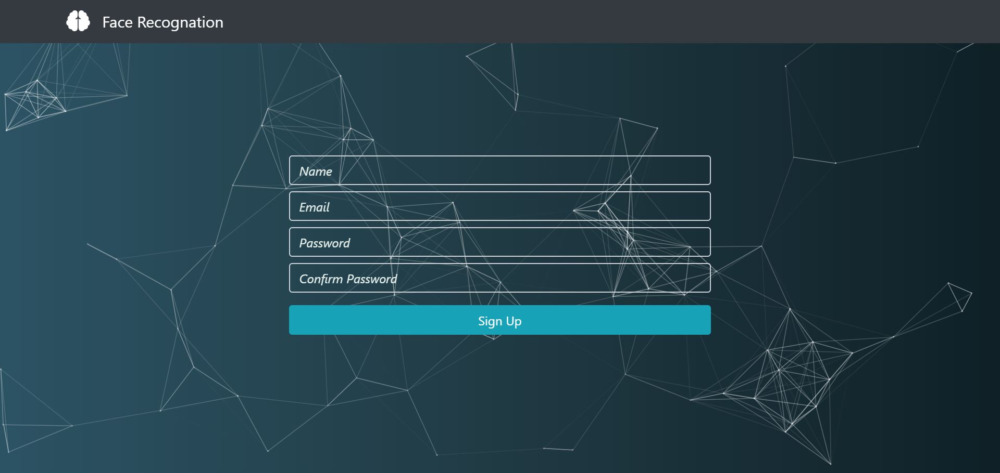
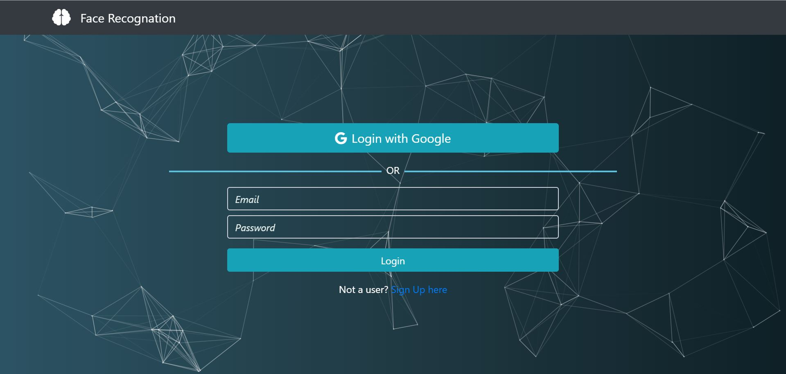
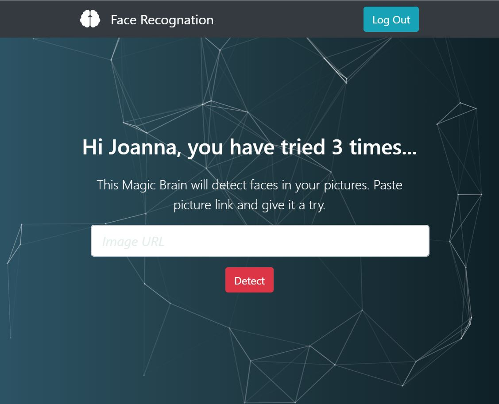
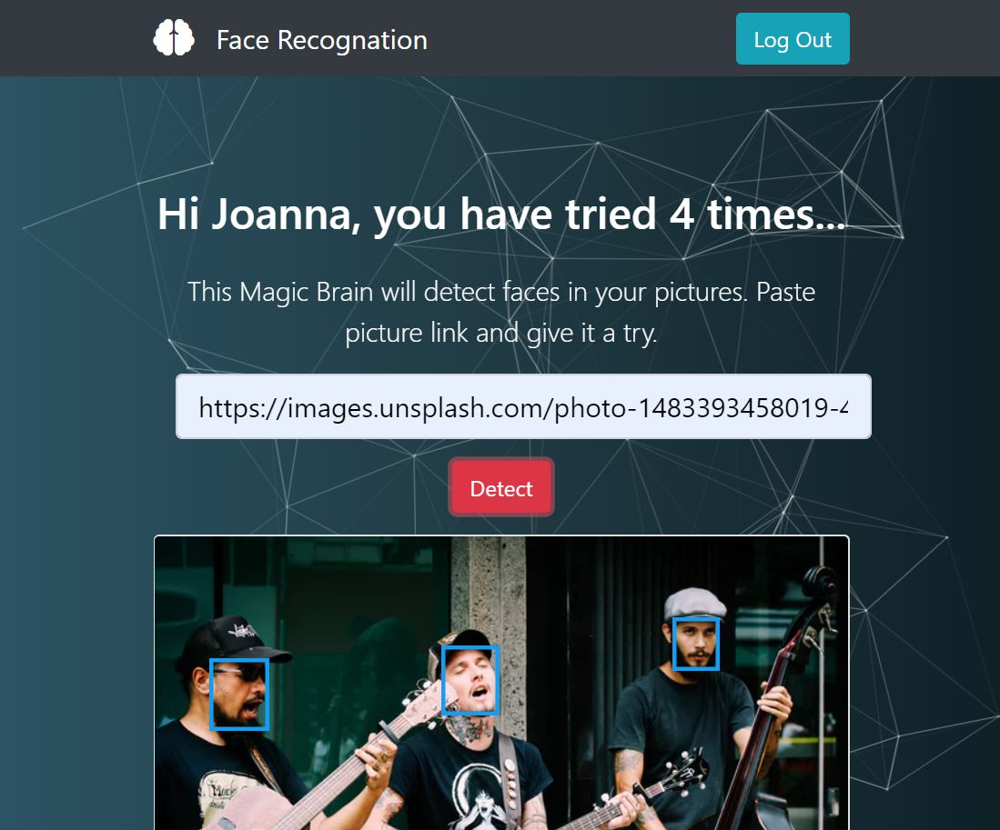

# Face-Recognition
Full stack image recognition app which can detect any human faces in an input image. 
[View online](https://magic-face-detector.herokuapp.com/)

## Tech Used
Bootstrap 4, ES6 JavaScript, React, Redux, Node.js, Express, PostgreSQL, JWT, Google OAuth 2.0, Git, Heroku

## Features
-	Create an extensive backend API with routes protected with JWT authentication 
-	Integrate Google OAuth2.0 for client so user can login with Google. User can also register and login with own email and password
-	Use third-party API clarifai to predict bounding box coordinate locations of human faces in an input image
-	Use particles.js to create particles for better background animation effect

## Screenshots
Demo: 

Sign up: 

Log in: 

Login with Google:

Homepage after sign in: 

Detect faces:

